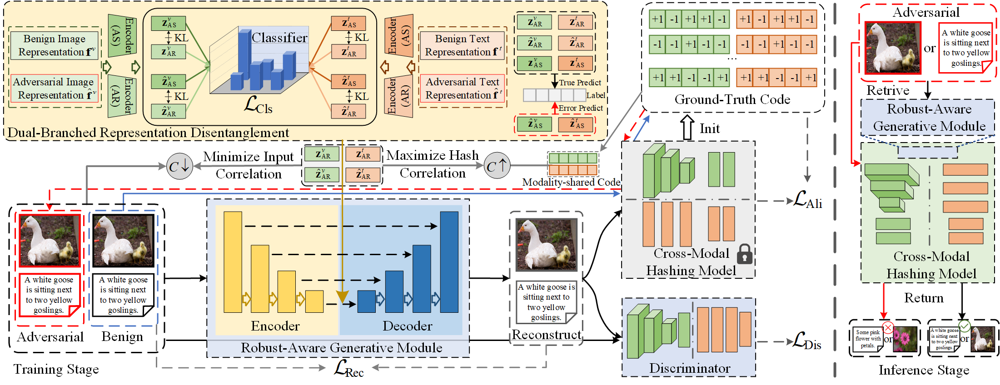

# AR-CMH
Attack-Resistant Cross-Modal Hashing via Disentangled Generative Learning and Bidirectional Correlation Defense

# Requirements
- Python 3.9.16
- Pytorch 2.0.1
- torchvision 0.15.2
- CUDA 11.7

# Pipeline


# Training
```shell
loading...
```
